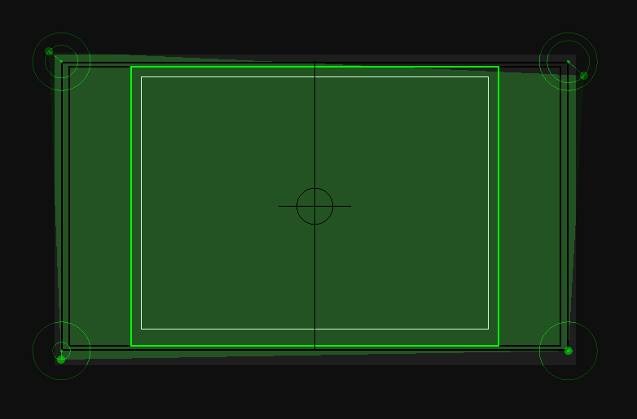
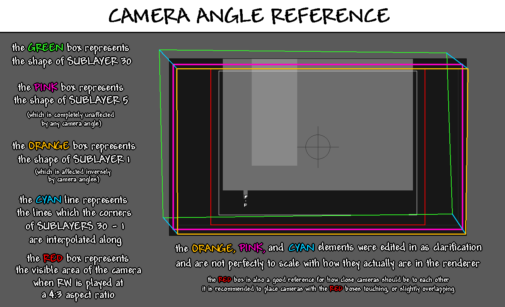

# Cameras编辑器
这是用于放置和移动Camera（摄像机）的编辑器。每个摄像机代表房间中的一个独立屏幕，并始终对应一个渲染出的.png文件。  

## 编辑
摄像机以绿色矩形/四边形显示。你可以通过点击选中摄像机，并通过拖拽移动它们。按住<kbd>Shift</kbd>的同时点击其他摄像机可以多选。选中摄像机后按<kbd>X</kbd>键可以删除。你也可以通过双击空白处或按<kbd>C</kbd>键添加摄像机。  

默认情况下，摄像机仅在Cameras编辑器中可见，但启用**View > Camera Borders**后，你可以在所有编辑器中看到绿色轮廓的摄像机边框。具体显示哪些边框由偏好设置窗口中的 **Camera border view mode**选项决定。 

### 吸附  
通常摄像机会以网格形式排列，因此Rained提供了吸附功能。移动一个或多个摄像机时，按住<kbd>A</kbd>/<kbd>D</kbd>或<kbd>W</kbd>/<kbd>S</kbd>键，将摄像机靠近另一摄像机的轴线即可对齐。

但如果你不需要兼容实现摄像机滚动的模组（如SBCameraScroll），则无需此操作。否则在使用平滑镜头模组游玩时，可能会因屏幕部分区域缺乏视觉效果而产生画面瑕疵。  

## 边界
每个摄像机有三个同心边界，从大到小依次为：  

1. 整个渲染区域。该区域的边界以黑色轮廓显示。  
2. 以16:9宽高比游玩雨世界时的整个可见区域。该区域的边界同样以黑色轮廓显示。为适应屏幕抖动，它比屏幕实际尺寸略小。  
3. 以4:3宽高比游玩时的整个可见区域，该区域的边界以绿色轮廓显示（官方编辑器中为红色）。当玩家进入该区域时，游戏会在此切换摄像机。  

## 角度
每个摄像机的四个角落各有一个可移动的点，表现为选中摄像机时显示的绿色圆环和圆点。这些点控制绿色四边形摄像机的顶点。  

<figure markdown="span">  
      
    <figcaption>摄像机四边形顶点，每个偏移量不同。</figcaption>  
</figure>  

每个圆点是摄像机四边形对应顶点的位置，外围圆环表示该顶点可偏离原点的最大距离。若要将顶点移出边界，可按住<kbd>Shift</kbd>操作。也可启用**Unlock camera angles**设置来反转此行为。  

绿色四边形本身控制着地形渲染的透视扭曲程度，每次渲染的图像由30个子图层组成，每主图层渲染的第五近子图层始终是完美矩形，但子图层越远，扭曲越强烈，直到最远层的形状与绿色四边形完全匹配。这使编辑器能以伪3D形式控制地形视角及透视效果的强弱。  

下图展示了摄像机角度及其视觉效果：  

<figure markdown="span">  
      
    <figcaption>图片来源：[Mayhemmm](https://github.com/mayhemmmwith3ms)</figcaption>  
</figure>  

## 渲染顺序
摄像机按创建顺序从先到后渲染，启用偏好设置窗口中的**Show camera numbers**选项可查看顺序，编号会以白色数字显示在摄像机中心。  

你无法直接调整摄像机顺序，只能通过移动或按需重新创建来间接调整。但你可以选中摄像机后点击**Edit > Set Priority**来指定首个渲染的摄像机。每次只能有一个优先摄像机，且该标记不会保存到房间文件中，重新加载后将被重置。点击**Edit > Clear Priority**可一键移除优先级状态，而无需选中对应摄像机。

