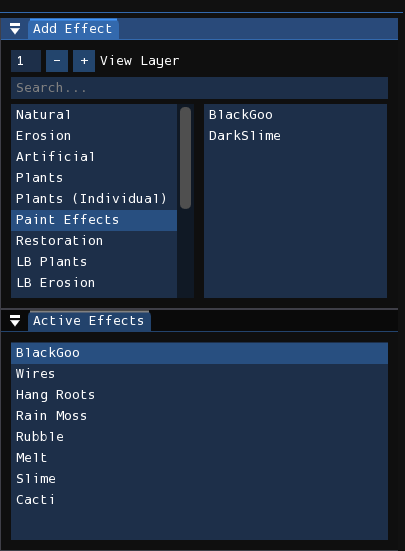
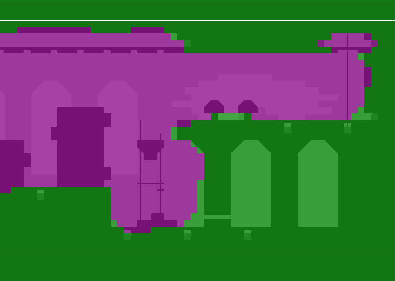

# Effects编辑器
**Effects编辑器**用于为关卡添加程序生成效果。其中许多效果通过操纵渲染图像中的像素来实现特定效果（例如使物体看起来下垂）。某些效果会在关卡中添加装饰性物体，如植物、草叶、电线、锁链等。 
 
*特效目录与激活特效列表*

要添加特效，请在"Add Effect"窗口中找到所需效果并点击。该特效的新实例将被添加到"Active Effects"列表中。可以添加同一效果的多个实例。之后，您可以通过点击拖拽或按"Move Up"和"Move Down"按钮来重新排列特效渲染顺序。也可以通过右键点击或按"Delete"按钮删除效果。

!> 最常用的两个效果是BlackGoo和Slime。BlackGoo用于创建"战争迷雾（？）"效果，遮蔽其下方所有实体几何体，并且在室内房间中比室外常见更易渗透墙体。Slime是基础的侵蚀下垂效果，几乎用于所有房间。

## 特效强度
 

*BlackGoo效果示例*

当特效激活时，其效果强度将显示在房间视图中。不同颜色表示特定位置的特效强度，其中粉色代表无效果，绿色代表更强效果。按住鼠标左键绘制绿色区域，按住右键绘制粉色区域。按住Shift键并移动鼠标滚轮可更改笔刷半径。

某些特效会以略微不同的方式影响效果强度的编辑。例如，创建BlackGoo时默认所有空白都被效果填充。部分效果（如BlackGoo和"Plants (Individual)"类别中的效果）仅允许在两种值范围内绘制：全强度或无效果。

## 选项
每个效果实例都有一组可配置参数，这些参数会影响特效的渲染，以下是常见的一些：

- **Layers**: 效果将渲染的图层
- **3D**: 效果将按子图层应用
- **Affect Gradients And Decals**: 效果将影响渐变和贴花
- **Color**: 植物效果使用的颜色，"Dead"表示使用普通关卡调色板，使其呈现灰暗死寂外观
- **Seed**: 用于随机数生成的种子值