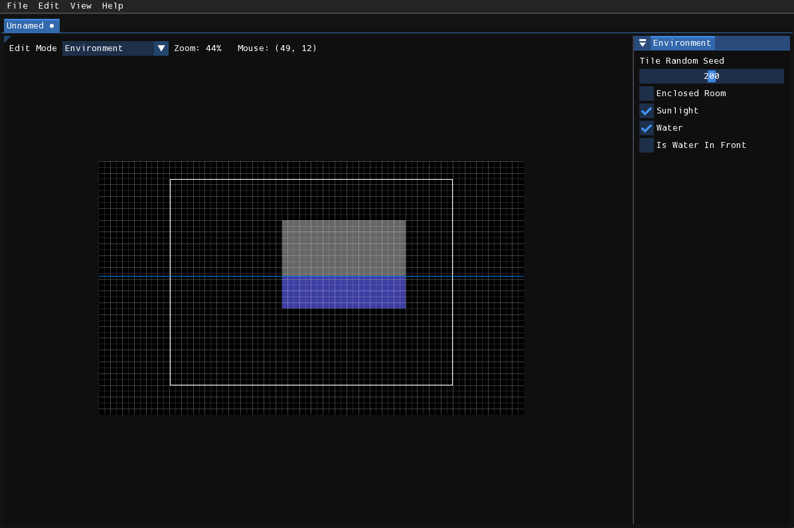

# Environment编辑器
**Environment编辑器**用于修改房间的杂项属性，本质上是官方编辑器"level overview"界面控件的移植版本。  

编辑器专属窗口包含以下选项：  

- **Tile Random Seed**：Tiles生成随机化部分使用的种子值  
- **Enclosed Room**：对应官方编辑器的"Default Medium"开关（实际功能未知）  
- **Sunlight**：关闭时房间将陷入黑暗；开启时应用Light编辑器创建的光照图  
- **Water**：启用房间水体，在关卡视图中按住鼠标可调节水位高度  
- **Is Water In Front**：关闭时水体将位于第一层后方  

启用水体后：  
- 所有编辑模式显示蓝色水位线  
- Environment编辑器中淹没区域显示蓝色色调  
- 在房间视窗任意位置拖拽鼠标可实时设置水位高度  

 启用水效果的房间  
