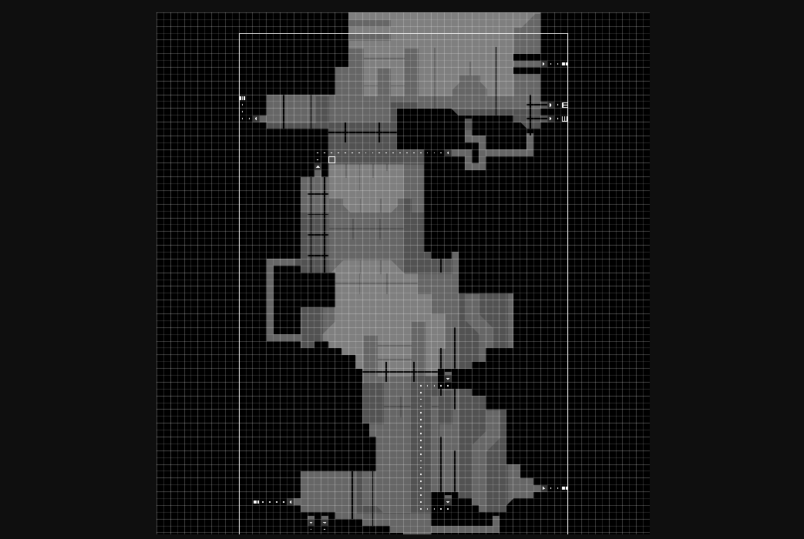
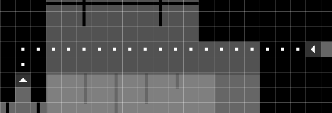
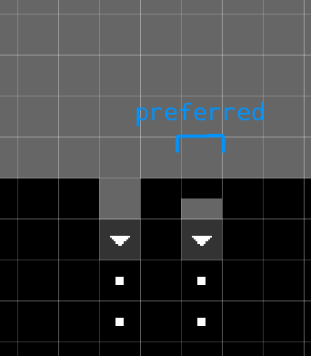
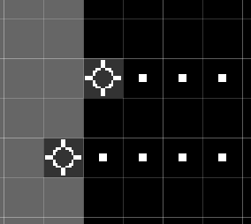

# Geometry编辑器
**Geometry编辑器**用于编辑房间的地形结构和一些可交互对象。右侧停靠的窗口标题为"Build"，包含可用于编辑几何结构和放置对象的工具，以及一些用于图层遮罩和镜像选项的复选框。

## 视图模式
View mode（视图模式）控制每个图层在关卡视口中的组合方式。

- **Overlay**: 默认视图模式，模拟原始关卡编辑器中图层的显示方式。每个图层渲染为独特的透明颜色，除第一层为不透明黑色外。
- **Stack**: 模仿RWE+中的图层显示方式，所有图层均为不透明黑色，较近的图层会遮挡后面的图层。

=== "Overlay"
    

=== "Stack"
    

## 工具
您可以通过点击或使用WASD快捷键从Build窗口中选择工具。有些是地形工具，用于修改单元格关联的几何形状；其他是对象工具，用于添加或删除单个单元格中的对象。

选中工具后，可在关卡视口中按鼠标左键使用。按鼠标右键则会根据工具类型执行擦除操作：几何工具会擦除几何结构，对象工具会擦除单元格内所有对象。

### 工具表现
部分工具会修改单元格使用的几何类型或其中包含的对象。修改几何的"几何工具"包括Wall、Air、Toggle Wall/Air、Invisible Wall、Slope、Platform和Copy Backwards。在单元格上使用这些工具会覆盖同类型工具之前放置的内容。其他"对象工具"则向单元格添加对象，因此在同一单元格使用同类型工具不会覆盖先前放置的内容。

使用地形工具时按鼠标右键会将单元格替换为空气。使用对象工具时则会擦除单元格内所有对象。若对象工具用于已包含该工具所放置对象的单元格，则会擦除该特定对象。对于Wall和Air工具，按住<kbd>Q</kbd>键再按鼠标左右键可执行区域填充。

按住<kbd>Shift</kbd>点击并拖动鼠标可编辑矩形区域（某些工具禁用此行为）。释放鼠标后，根据按下的鼠标按钮填充或擦除选定区域。

Slope工具的矩形选择行为特殊，用于创建用户指定尺寸的斜坡结构。它会将选区约束为正方形，释放鼠标后尝试构建与正方形尺寸匹配的斜坡结构（方向由相邻几何推断）。若无法创建合法斜坡结构，则不放置任何内容。

### 非捷径（管道）工具
非捷径工具列表：

| Tool                                                         | Description                                                  |
| ------------------------------------------------------------ | ------------------------------------------------------------ |
|  Wall                       | 固体地形，若墙放置在第二层，则蓝蜥蜴等背景攀爬生物可在其上行走。 |
|  Air                         | 空气。                                                       |
|  Toggle Wall/Air         | 对应官方关卡编辑器中的"Inverse"。功能显而易见。              |
|  Slope                     | 45度斜坡，仅可放置在角落。                                   |
|  Invisible Wall        | 对应官方关卡编辑器中的"Glass"，单元格有碰撞但不可见。        |
|  Platform              | 半砖块，游戏中可从底部自由穿过，但从上方穿过需按住下键。     |
| / Beam | 又称杆子，生物可攀爬其上。                                   |
|  Fissure                 | 对应官方关卡编辑器中的"Crack Terrain"。用于创建特殊隧道类型，游戏中不常用。普通隧道使用空气块。 |
|  Waterfall             | 用于创建装饰性瀑布，水从放置瀑布对象的单元格向下流动。       |
|  Batfly Hive              | 仅可放置在地面，生成蝠蝇钻入的尖刺白色物体。                 |
|  Forbid Fly Chain       | 放置在天花板，阻止蝠蝇悬挂成链。                             |
|  Garbage Worm               | 放置在地面，标记垃圾虫生成位置。                             |
|  Worm Grass            | 放置在地面，生成虫草高度与放置的块宽度成正比。               |
|  Copy Backwards             | 将高亮区域的几何复制到后一层。                               |

### 捷径
Shortcuts（又称"pipes"）用于房间间或房间内传送。以下是四个捷径示例，第一个是同一房间内两点间的双向连接。

下图包含三个捷径。最上方将生物传送到不同房间，中间是生物巢穴，最下方是Whack-A-Mole洞，将生物传送至同一房间内随机另一个Whack-A-Mole洞。

捷径入口需满足特定条件才能被视为有效。首先，入口周围3x3区域必须为固体块（入口块除外，应为空气或半砖块——半砖块用于朝下的入口）。例如，要在墙上创建入口，需在墙中放置一个空气块，并将孔洞中的下一个固体块替换为入口。其次，必须在入口方向放置shortcut dot。若入口左侧有空气块，则需在入口右侧开始放置dot路径。

正确创建入口后，其图形会显示正确方向的箭头。随后使用"Shortcut Dot"工具创建路径。每个点与下一个相连，仅限四向连接（不可对角线）。

路径另一端由不同捷径对象决定其行为。

| Tool                                                         | Description                                                  |
| ------------------------------------------------------------ | ------------------------------------------------------------ |
|  Shortcut Entrance | 创建同一房间内两点间的双向连接。                             |
|  Room Entrance            | 创建通往其他房间的连接。官方关卡编辑器中称为player entrance，其他编辑器中显示为"P"。 |
|  Creature Den                | 官方关卡编辑器中称Dragon Den，供非蛞蝓猫生物在降雨时生成和休眠。 |
|  Whack-a-mole Hole          | 非蛞蝓猫生物进入后会随机传送至同一房间内其他Whack-a-mole洞。 |
|  Scavenger Hole             | 允许拾荒者在区域漫游时生成或移动至此房间。                   |
|  Shortcut Dot           | 可用捷径点结束路径，这使捷径有效但不可进入。                 |

有效shortcut示例：

=== "Shortcut in wall"
    

=== "Shortcut in floor"
    

=== "Floating shortcuts"
    

=== "No shortcut dots"
    

无效shortcut示例：

=== "Invalid configuration"
    

=== "Outside of level border"
    

## 图层遮罩
工具选择器下方有三个复选框"Layer 1"、"Layer 2"和"Layer 3"，用于控制工具操作影响的图层遮罩。点击复选框或使用<kbd>E</kbd>、<kbd>R</kbd>、<kbd>T</kbd>键可启用/停用各图层。按<kbd>Tab</kbd>可下移遮罩（若仅选中一层，效果等同选择下一层）。

## 镜像
图层遮罩下方是镜像选项。"Mirror X"启用时，工具操作会沿出现的红线水平镜像；"Mirror Y"则控制垂直镜像。

点击拖动可移动镜像分割线。按住<kbd>Shift</kbd>拖动会吸附到单元格边缘（忽略中心）。双击分割线可重置居中位置。