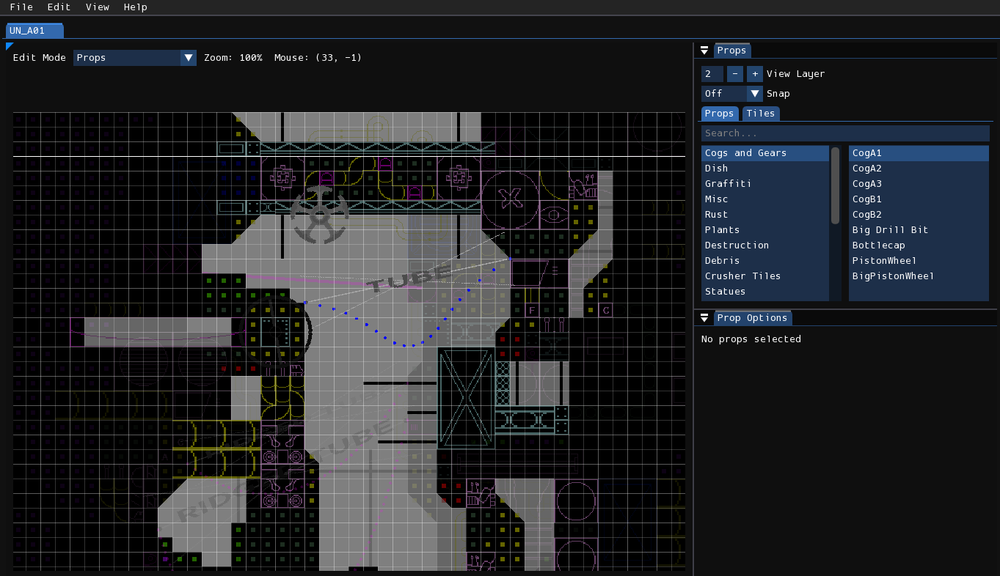
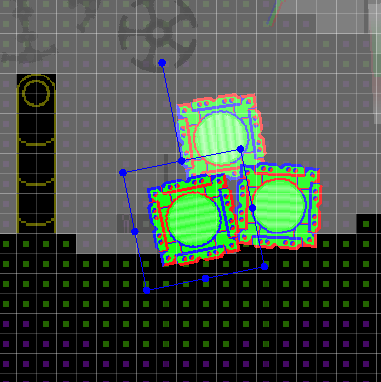
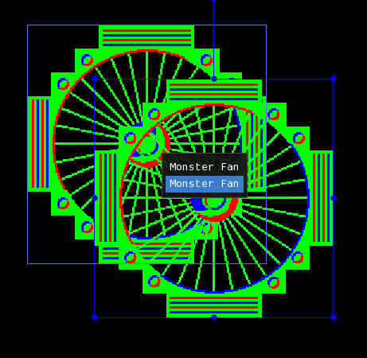
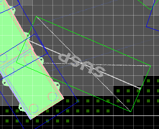
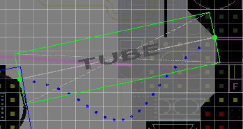

# Props编辑器  

  

**Props（道具）**的使用方式与图块类似，但在放置时拥有更高的自由度。它们不需要对齐网格，可以自由旋转，并且可以放置在30个子图层中的任意一个，而不仅仅是3个主图层之一。此外，道具还用于制作毁坏效果以及放置物理模拟的绳索、管子和电线。  

!> 与图块不同，道具不会影响地形。如果你希望道具具有碰撞效果，必须放置与之匹配的不可见地形。这可以通过使用Glass材质或填充空图块来实现。  

## 编辑道具  

首先，你需要在道具目录中选择要放置的道具，类似于选择图块的方式。然后，右键点击房间视图或按下C键将其放置。  
 一个选中的道具。  

选中道具后，你可以通过点击并拖拽来移动道具，通过拖拽其角落或边缘来缩放道具，通过拖拽突出的控件或按住Q或E键来旋转道具。  

可以同时选中多个道具，方法是按住Shift键的同时选择新的道具。取消选中已选中的道具也是通过相同的操作完成。此外，如果有多个道具重叠在一起，你可以通过双击并从弹出菜单中选择特定的道具来单独选中它。  
 

*出选择菜单。*  

!> 如果你对意外选中不希望选中的图层中的道具感到困扰，可以使用**Prop selection layer filter**选项来更改相对于当前主图层允许选中道具的图层范围。  

你还可以通过将道具做为任意四边形来编辑而扭曲其形状。首先按下F键激活顶点模式（Vertex Mode），道具的轮廓会变为白色或绿色，你可以随意操作白色轮廓道具的边线和角度。绿色道具的说明将在后文解释。  

## Prop types  

道具有三种不同类型：  

- Standard（标准）  
- Longs（长型）  
- Rope-type props（绳索类道具）  

这些类型决定了道具的编辑和交互方式。  

### 标准道具  

这些道具在被选中时会显示蓝色轮廓。当顶点模式开启时，轮廓会变为白色，表示你可以像往常一样扭曲它们。  

#### 毁坏效果道具（Destruction props）  

这些道具的渲染方式与其他道具不同，采用减法渲染而非加法渲染。它们在房间中的存在会影响**Render Order**选项的意义。  

#### 贴花（Decals）  

在渲染时，贴花会将其纹理粘贴到道具所交集的任何固体区域上。  

### 长型道具 

 长型道具“Drill Suspender”在顶点模式下的视图。  

这些道具在被选中时会显示绿色轮廓。在顶点模式关闭时，它们的编辑方式与标准道具相同。但如果顶点模式开启，你无法像标准道具那样扭曲它们，而只能移动它们的端点。  

### 绳索类道具 

 顶点模式下的管子视图。  

绳索类道具在编辑方式上与长型道具类似，但它们还能模拟绳索的物理。绳索的每一段显示为一个点，要模拟绳索物理，按住**Simulate**按钮或空格键，松开按钮后，绳索会停止模拟。  

## 道具选项

右下角是一个标题为**“Prop Options”**的窗口。在这里，你可以编辑当前选中的一个或多个道具的选项。以下是所有可能的道具选项列表。注意，并非所有道具都支持所有选项。  

- **Render Order**：如果房间中有毁坏效果道具，此选项会影响道具的渲染顺序。  
- **Depth Offset**：道具的子图层位置，范围为0-29。每10个单位对应下一个主图层。  
- **Seed**：用于程序化生成的种子值。  
- **Render Time**：用于控制道具是否在效果之前或之后渲染。  
- **Custom Depth**：道具在子图层中的大小。  
- **Variation**：道具使用的变体。  
- **Custom Color**：贴花道具的颜色。  
- **Apply Color**：如果道具应使用其自定义颜色，则设置为True。  

以下选项仅适用于绳索类道具：  

- **Flexibility**：控制绳索的柔韧性，垂直缩放道具也会达到相同效果。  
- **Release**：控制绳索的哪一端不固定。  
- **Thickness**：绳索的粗细。