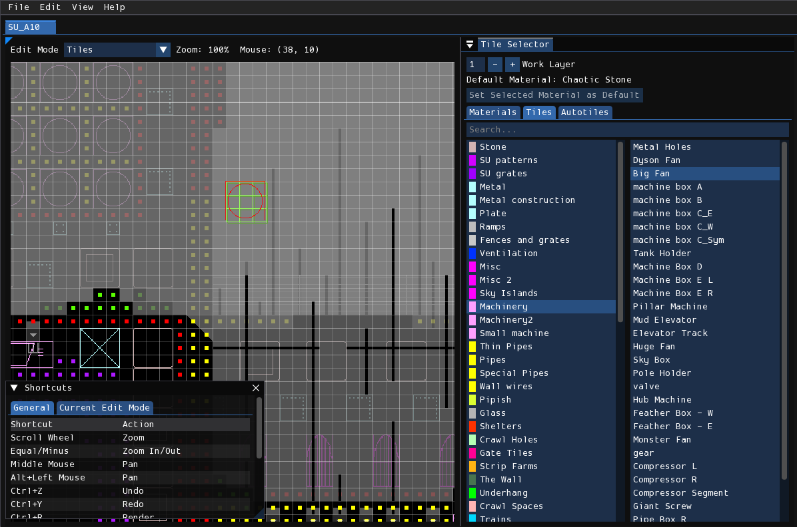
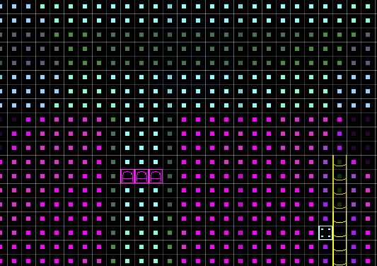
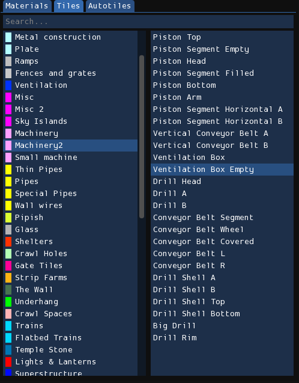
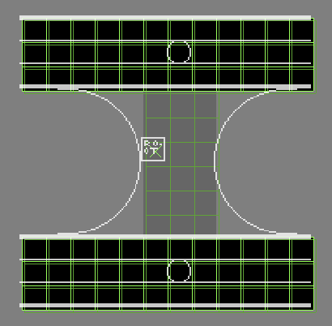
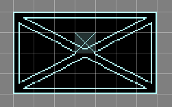
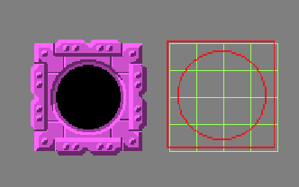
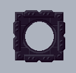
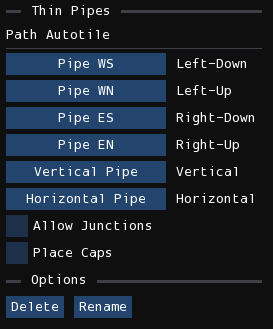

# Tiles编辑器

Tiles编辑器用于用材质与图块装饰房间。编辑图块和材质是房间编辑流程的关键环节，通常在地形编辑器中完成初步布局后进行，且常与地形编辑协同工作。掌握图块和材质设计基本原则对打造优质视觉效果至关重要（本文档不涉及图块和材质设计的通用原则)。

## 材质

包含多个材质的区域

Materials（材质）本质上用于为房间几何结构添加纹理。之所以说"本质上"，是因为不同材质处理几何细节的方式各异：有些是简单平铺的大尺寸纹理，有些会在边缘和角落添加特定图形，还有些（如Trash家族和Small Pipes）采用程序化生成的细节。

### 选择
通过瓦片选择器窗口的"Materials"标签页可进行材质编辑。激活该标签页后，可选择要绘制的材质。左栏显示材质分类，右栏显示当前分类下的可用材质。将鼠标悬停在右栏项目上会显示该材质的预览图。

### 放置
已应用的材质在房间视图中显示为位于单元格中心的纯色小方块。

按住鼠标左键可为几何结构添加材质，右键则擦除材质。按住<kbd>Shift</kbd>滚动滚轮可调整笔刷大小。按住<kbd>Shift</kbd>+鼠标左右键拖动可填充/擦除矩形区域。

!> 若单元格已被瓦片占据，材质将不可见。移除瓦片会显露底层材质，但被瓦片遮挡的材质不会保存到文件中。

绘制时有两种修改器可用：按住<kbd>G</kbd>激活"Force Geometry"可在空白处自动生成墙壁几何结构来承载材质；按住<kbd>R</kbd>激活"Ignore Different"可避免修改与当前绘制材质不同的现有材质。两者可同时生效。

## 图块
Tiles（图块）是预制美术资源，包含金属梁、管道、石块、机器等场景元素。虽功能类似常规游戏图块系统，但Rain World的图块有其特性：

1. 可任意网格对齐尺寸
2. 每个图块有几何规范，限制其可放置的几何模式
3. 支持单层或双层深度
4. 部分图块缺失仍能正常渲染

### 放置
在图块选择器（下图）中选择目标图块后，房间视图中会出现称为"tile cursor"的图块预览。左键放置，右键移除。按住<kbd>Shift</kbd>+鼠标键可操作矩形区域。

瓦片选择器

!> 通过顶部"Work Layer"输入框或<kbd>Tab</kbd>键可切换工作图层。

### 地形要求

每个图块指定其占位的几何模式（称为"specs"）。在Rained中，这些规范显示为图块光标后的绿色轮廓：第一层为亮绿色，第二层（若需要）为深绿色。

除两种特殊情况外，每个单元格的要求直观可见：
- **Unspecified**：无轮廓，允许任意地形类型
- **Air**：显示十字，要求该处必须为空气单元格

### 图块修改
当底层地形不符合图块规范时，光标会显示为红色。此时可通过两种修改器强制放置：
- **Force Placement**(<kbd>F</kbd>)：无视图块条件直接放置
- **Force Geometry**(<kbd>G</kbd>)：自动调整底层几何以满足规范

使用矩形区域操作时，"Force Geometry"有特殊行为：短按会为现有图块补全地形规范，长按会在释放鼠标时强制生成地形结构。

### Heads 和 Bodies
图块实际由1x1网格的"原子"组成：一个tile head（必选）和若干tile bodies（可选）。tile head是图块中心参考点，通过**View > Tile Heads**可高亮显示。

标记X处为瓦片的tile head

可强制放置图块覆盖部分tile bodies（但不可覆盖tile head）。缺失tile bodies不影响整体渲染，但会导致该处地形结构与图块图形重叠显示。

### 图块图像
Rained默认显示的图块图像并非游戏内实际渲染效果，而是简化表示。通过**View > Tile Graphics**可切换至真实渲染效果，配合**View > Palettes**可启用调色板获得更准确表现。

需注意预览效果在几何渲染方面不准确。实际渲染时，被tile head/bodies占据的单元格不会渲染地形结构。例如"Ventilation Box Empty"图块：

Rained中的显示效果

游戏实际渲染效果（注意实体几何未渲染）

## 自动图块
部分图块用于构建结构（如栅栏、SU图案、管道等）。Autotiles（自动图块）系统可加速此类结构的创建流程。

在Tile Selector窗口选择"Autotiles"标签页，从分类下拉列表中选择一种自动图块即可使用。

### 类型
自动图块分为两类：
#### 矩形自动图块
通过划定矩形区域创建结构。选择后拖动鼠标定义区域，释放后自动填充。

#### 路径自动图块
通过绘制路径创建结构。选择后按住左键移动鼠标创建路径节点，释放后自动生成。

!> 按住<kbd>Shift</kbd>可绘制直线路径。

### 自定义自动图块
点击**Create Autotile**按钮可创建无需编程的路径自动图块。命名并选择分类后，会出现配置界面：

自定义路径自动瓦片配置

在此界面可指定1x1尺寸的图块元素，启用连接点/端帽功能并设置对应图块。

!> 部分内置自动图块也采用此系统。如需创建矩形自动图块或高级路径自动图块，需编写Lua脚本（参考`scripts`目录内的示例）。