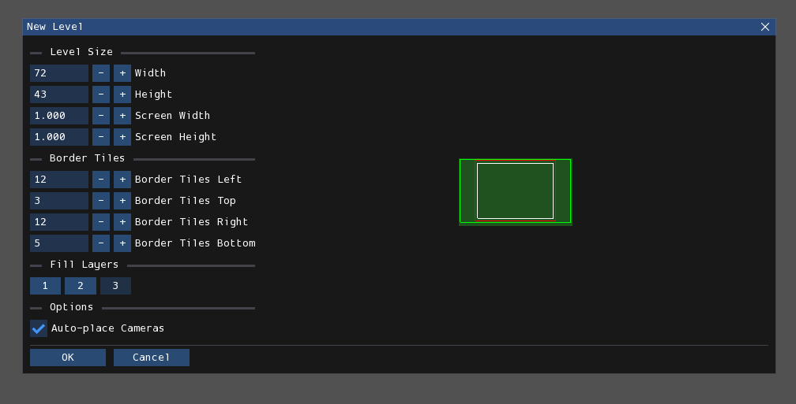

# 概述

每个房间由三个工作层构成，每个层均形成网格。第一层最靠近摄像机，是所有生物会碰撞和交互的层。第二层次近于摄像机，是首个背景层，部分生物可能与之交互（例如攀爬）。第三层（最终层）距离最远，任何生物均无法交互。

在关卡编辑器中创建的关卡会被渲染为：  
- 一个文本文件（.txt），仅包含游戏存储水位、碰撞等必要信息；  
- 若干图像文件（.png），每个摄像机对应一个文件，包含整个屏幕的关卡视觉效果。

游戏使用的渲染文件与关卡编辑器文件互不兼容，反之亦然。

## 创建房间

 
*"新建关卡"窗口*

此窗口用于配置新关卡的参数，包含以下选项：  
- **Width/Height（宽度/高度）**：以网格单位表示的关卡尺寸。  
- **Screen Width/Screen Height（屏幕宽度/屏幕高度）**：以屏幕数量表示的关卡尺寸。网格单位与屏幕的换算公式如下：  

        宽度 = 52 * 屏幕数 + 20  
        高度 = 40 * 屏幕数 + 3  

- **Border Tiles（边界图块）**：控制关卡边界各侧与边缘的距离，具体作用[下文详述](#border)。  
- **Fill Layers（填充图层）**：选择需要填充实体地形的图层。  
- **Auto-place Cameras（自动放置摄像机）**：勾选后，将根据关卡范围自动放置一个或多个摄像机；未勾选时，仅会在与关卡创建参数无关的位置放置单个摄像机。

## 房间视窗

  

房间视窗占据屏幕大部分区域，是查看和编辑当前关卡的主要界面。  

缩放操作可通过鼠标滚轮、视图菜单按钮或<kbd>+</kbd>/<kbd>-</kbd>键实现。平移操作可通过按住鼠标中键/<kbd>Alt</kbd>键拖拽，或使用方向键完成。使用方向键时，按住<kbd>Shift</kbd>可加速平移。

## 边界
雨世界设有边界，界定游戏中可交互区域。在Rained中边界显示为白色矩形。  

边界外的内容会出现在.png渲染图中，但不会写入描述关卡几何的.txt文件。因此边界外区域不可交互：生物若试图与边界外地形互动，将穿过实体方块或悬空站立（具体行为取决于其位置最近的边界内方块）。Geometry（地形）编辑器中放置在边界外的对象会显示为红色（而非白色），表明其在游戏中无效。

## 调整尺寸
点击**Edit**菜单中的"Resize Level（调整房间尺寸）"按钮将打开此窗口：  

  

- **Width/Height（宽度/高度）**：以网格单位表示的目标尺寸。  
- **Screen Width/Screen Height（屏幕宽度/屏幕高度）**：以屏幕数量表示的目标尺寸。基本的换算公式如下：  

        宽度 = 52 * 屏幕数 + 20  
        高度 = 40 * 屏幕数 + 3  

- **Anchors（锚点）**：控制尺寸调整的基准点，可选关卡四角、四边中心点或关卡中心。  
- **Border Tiles（边界图块）**：控制关卡边界各侧与边缘的距离。

## 编辑模式
每个关卡可通过七种"编辑模式/Edit Mode"（常被称为"编辑器/Editor"）分别修改不同方面：  

- **[Environment](Environment编辑器.md)**：编辑关卡的杂项属性
- **[Geometry](Geometry编辑器)**：编辑可玩区域的地形结构与对象
- **[Tiles](Tiles编辑器)**：放置预制图块资源以构建场景  
- **[Cameras](Cameras编辑器)**：编辑摄像机 
- **[Light](Light编辑器)**：编辑光照与阴影
- **[Effects](Effects编辑器)**：控制程序化生成的装饰物、侵蚀效果、植物等  
- **[Props](Props编辑器)**：自由放置预制资源贴图，支持完全自定义位置/旋转/缩放

切换编辑模式可通过以下方式实现：  
1. 按数字键1-7
2. 点击屏幕左上角的**"Edit Mode"**下拉列表
3. 按<kbd>`</kbd>键打开快捷菜单
