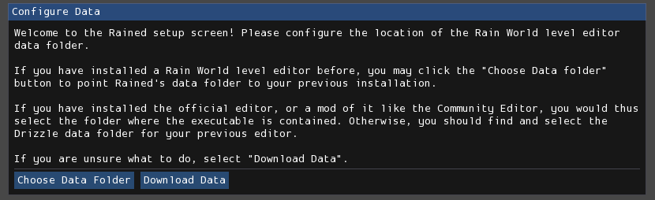

# 安装与更新  
Rained有两种安装与更新方法：从GitHub发布页安装，或使用rainedvm。两种方法可交互使用。

## 从GitHub安装  
您可以从[GitHub发布页](https://github.com/pkhead/rained/releases)安装Rained。下载适用于您平台的压缩包（.zip或.tar.gz）并解压到磁盘，点击名为"Rained.exe"或"Rained"的文件以启动Rained。如果您在Windows上，还会有名为"Rained.Console.exe"的可执行文件，该文件用于从终端或命令行工具运行。在Linux上不需要这种分装，因此不包含该文件。

Rained会在启动时或在关于窗口中通知您新更新。您可以在偏好设置窗口中禁用更新检查器。

如果要更新Rained，您应该删除并替换安装文件夹中的所有文件和文件夹，**除了**：

- config/
- 您的Data文件夹（如果存在）

然后从发布页下载并解压新版本的Rained。

您应确保对任何文件所做的潜在更改不会被意外覆盖。此外，如果在更新后打开Rained时窗口错误，您应该自行修复（比较麻烦），或用新更新中的版本替换config/imgui.ini。

## rainedvm  
rainedvm是一个简化Rained版本维护过程的程序，下载地址[在此](https://github.com/pkhead/rainedvm/releases)。

在下载的.zip或.tar.gz文件中含有**rainedvm**可执行文件，只需解压并将其放在要安装Rained的文件夹中。然后启动该可执行文件，这将打开如下窗口：

  

选择要安装的版本，然后按"Install"按钮，完成后即可运行Rained。

Rained会在启动时或关于窗口中通知您更新，您可以在设置窗口中禁用更新检查器。

如果要更新Rained，再次运行rainedvm，选择要升级到的版本，然后按"Install"。如果在更新后启动Rained时窗口错误，请删除config/imgui.ini文件，在版本管理器中选择当前版本，然后按"Sync"（替换"Install"按钮）。这将重置该版本的窗口配置为默认值。

### 文件冲突  
rainedvm将检测您是否修改了任何文件（config/preferences和config/imgui.ini除外），如果该文件在新版本中已被更改，将询问您是要用新版本覆盖更改，还是保留文件更改。在每个提示中，如果要更新文件，请选择"Overwrite Changes"，否则选择"Keep Changes"，您也可以通过按"Cancel"按钮取消整个操作。

## 资源安装  
首次启动Rained应显示如下界面：

   

如果您的计算机上尚未安装其他Rain World房间编辑器，请选择"Download Data"，否则请继续阅读。

每个Rain World房间编辑器都应附带一组tiles、props和原版及倾盆大雨的房间文件。然而，尝试在不同房间编辑器之间使用同样的瓦片、道具和创建的房间可能很麻烦，因为它们有自己的文件夹/目录来存储这些数据。此外，捆绑的房间文件集需要约4 GB存储空间。

为此，Rained允许您选择是否要使用计算机上预先存在的目录来存放tiles、props和房间。如果您的计算机上尚未安装这些内容（或您想要新安装），请选择"Download Data"从互联网下载所需文件。否则，您可以选择"Choose Data Folder"。这将打开文件浏览器，您需要在此选择包含以下子目录的正确数据目录：

- Graphics
- Props
- Levels
- LevelEditorProjects（可选）
- Materials（可选）

您也可以在此初始设置后更改数据目录。通过修改偏好设置窗口(**File > Preferences**)中Assets页面的Data Path选项完成此操作。

!!! note 
当您选择"Download Data"时，进度条在大部分时间内将保持0%。这是所用下载提供商的缺陷。

## 依赖项  
!!! note 
本节仅与在Windows上运行Rained相关。

Rained唯一的依赖项是Microsoft Visual Studio C++ runtime。Rained*确实*使用C#编写，但其用于窗口和图形的一些库是用C++编写的。

要检查是否安装了所需依赖项，只需尝试运行Rained。如果无法打开窗口并启动失败，很可能需要安装它。幸运的是，安装非常简单，C++运行时的安装程序可[在此](https://aka.ms/vs/17/release/vc_redist.x64.exe)下载。运行exe文件，安装过程完成后即可启动Rained。