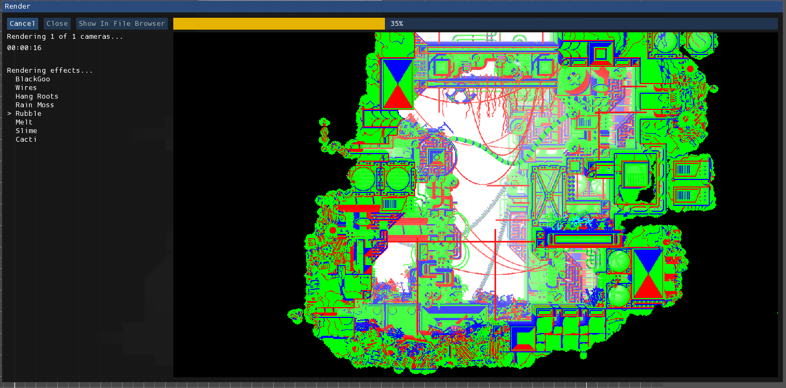
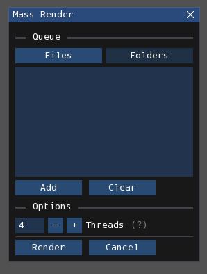

# 渲染与游玩
渲染是将房间文件处理为以下内容的过程：
- 一个文本(.txt)文件，仅包含游戏需要存储的信息，如水位和地形碰撞数据
- 若干图像(.png)文件，每个摄像机对应一个图像，包含整个屏幕的房间视觉效果

这些输出文件可被雨世界解析，从而使你制作的房间可供游玩。

## 渲染
渲染过程使用[Drizzle](https://github.com/SlimeCubed/Drizzle/tree/community)——这是对官方编辑器中原版渲染器的移植（原版基于Adobe Director开发）。该工具高度注重保持1:1的还原度，因此无需担心渲染效果与原版编辑器的差异。同时其运行效率更高。

### 单房间渲染
首先需要打开并激活目标房间。点击**File > Render**开始渲染流程，此时将打开以下窗口：

<figure markdown="span">
    
    <figcaption>渲染窗口</figcaption>
</figure>

左侧文字显示当前渲染状态，右侧视窗提供实时渲染预览。窗口左上角有三个按钮：
- **Cancel**：尝试中止渲染操作
- **Close**：关闭窗口，仅可在渲染完成或取消后操作
- **Show In File Browser**：展示生成的文件，仅可在渲染完成后操作

!!! info
若在Drizzle初始化过程中取消，该操作需等待初始化完成后才会生效，也就是说通常需要数秒才能关闭窗口。

### 批量渲染
可通过**File > Mass Render**同时处理多个房间，此时将打开这个窗口：

<figure markdown="span">
    
    <figcaption>批量渲染窗口</figcaption>
</figure>

首先需将目标房间添加至队列。窗口的两个列表分别对应单个文件和整个文件夹，通过标签按钮切换。点击 **"Add"**按钮从文件浏览器选择项目。

您也可指定最大线程数，以并行渲染队列中的多个房间，这可以减少总等待时间。但线程数越高，内存占用越大，CPU负载也越重，每个线程约消耗1GB内存。设置过高可能导致Rained或其他程序崩溃，因此建议根据系统配置选择。提供的默认值适合多数电脑。

## Drizzle选项
通过File > Preferences**进入Drizzle设置页面可配置多项参数：

### 启动时初始化
若希望避免每次渲染都等待Drizzle运行时初始化，可在偏好设置的Drizzle页面启用**Initialize Drizzle on app startup**选项，使其在整个会话期间保持就绪状态，注意这个功能需要重启Rained才能生效。

### 配置
偏好设置页面**"Rendering"** 类别下提供多项Drizzle渲染配置选项，这些是对editorConfig.txt文件的图形化编辑接口。

## 游玩你的房间
完成渲染后，需将生成的.txt和.png文件复制到以下任一目录，这样游戏才能正确地读取它们，路径相对于`RainWorld_Data/StreamingAssets`或你的模组文件夹：
- **竞技场**：`/levels`
- **地区地图**：`/world/XX-rooms`（其中XX为区域缩写）

放入`levels`文件夹是最简便的访问方式，可直接从竞技场进入，而地区地图中的房间稍微复杂一些，需要额外编辑房间连接的.txt文件才能访问。

进入房间后，需使用开发者工具进行进一步配置。同时需要编辑world_XX.txt文件，可通过文本编辑器或World Editor等外部工具来连接房间和添加生物生成点。本文档不涉及这些操作细节（因Rained仅专注于房间编辑），相关资料请参阅[此处](resources.md)。