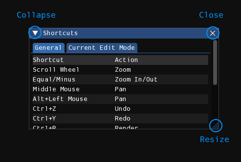
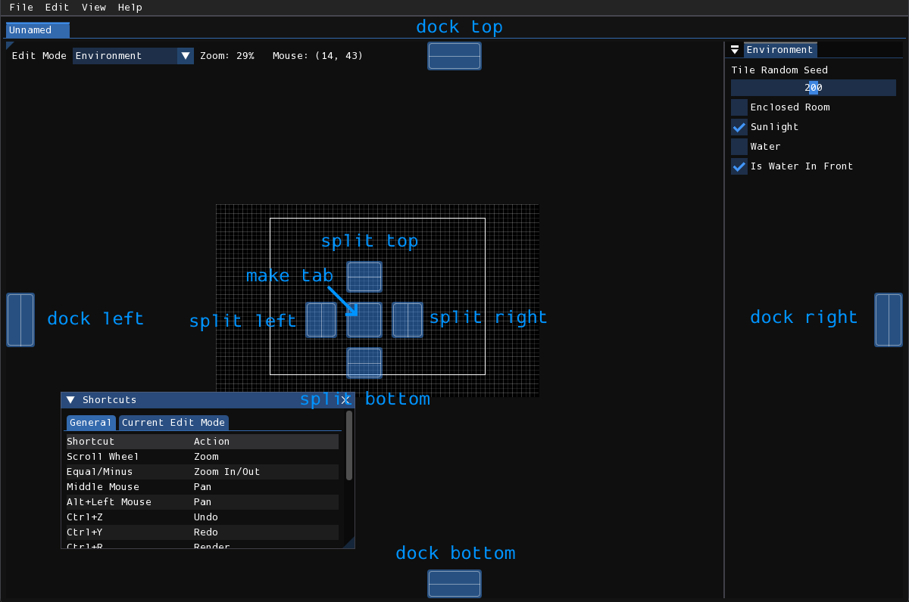
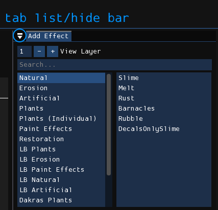

# 用户界面  
界面由多个窗口构成，每个窗口包含按钮、滑块、文本等控件。

## 窗口
### 浮动窗口  
  

- **Collapse**：折叠窗口内容，仅显示标题栏。再次点击可展开  
- **Close**：关闭窗口（非所有窗口具备）。关闭后可通过菜单重新打开  
- **Resize**：拖拽此处或窗口边缘调整尺寸  

点击标题栏或窗口空白区域拖拽可移动窗口。通过标题栏拖拽时，界面会显示停靠参考线，将鼠标悬停参考线可选择停靠位置：  
  

按住<kbd>Shift</kbd>拖拽标题栏可移动窗口而不触发停靠参考线。已停靠窗口可通过拖拽标题栏解除停靠。

### 停靠窗口  
  

停靠窗口带有倒置"弹出"图标按钮：  
- 作为垂直标签栏（多窗口共用空间时）  
- 或作为控制标签栏显隐的按钮  

隐藏标签栏时，窗口左上角显示右向三角▶️，点击可重新显示标签栏。

## 控件
### 滑块 (Slider)  
水平拖拽鼠标调整数值。按住<kbd>Ctrl</kbd>/<kbd>Cmd</kbd>点击可手动输入数值。

### 拖拽输入 (Drag input)  
功能与滑块相同，但无旋钮且无数值限制。同样支持<kbd>Ctrl</kbd>/<kbd>Cmd</kbd>点击输入。

## 菜单栏
采用标准菜单栏设计，位于窗口顶部。本文档中菜单项按 **菜单 > 子项** 格式标注，例如 **File > Open**。

### File  
- **New**：创建新房间  
- **Open**：从磁盘打开房间  
- **Open Recent**：打开近期编辑过的房间  
- **Save**：保存当前房间  
- **Save As**：另存房间文件  
- **Render**：使用Drizzle渲染房间  
- **Export Geometry**：导出房间地形数据（不渲染视觉效果）  
- **Mass Render**：批量渲染多个房间  
- **Preferences**：打开设置窗口  
- **Quit**：退出程序  

### Edit  
- **Undo**：撤销操作  
- **Redo**：重做操作  
- **Resize Level**：打开房间尺寸调整窗口  
- **Commands**：执行插件/脚本命令  
- 最后一栏为当前编辑模式专用功能菜单  

### View  
- **Zoom In**：放大视窗  
- **Zoom Out**：缩小视窗
- **Reset View**：重置视窗缩放与平移  
- **Grid**：切换网格显示  
- **Tiles**：非Tiles编辑模式下显示tiles
- **Props**：非Props编辑模式下显示props  
- **Camera Borders**：显示摄像机边界  
- **Tile Graphics**：切换Tile渲染模式（游戏内/编辑器预览）  
- **Obscured Beams**：显示墙体内部横梁的负空间  
- **Tile Heads**：显示Tile头部十字标记  
- **Keyboard Shortcuts**：显示快捷键窗口  
- **Logs**：显示日志窗口  
- **Palettes**：显示调色板窗口  
- **Tile Preview**：打开Tile预览效果  
- **Home**：打开主页标签  
- **Show Data Folder**：打开Drizzle数据目录  
- **Show Render Folder**：打开渲染输出目录  

### Help  
- **Manual**：打开在线手册  
- **About**：显示关于窗口  
